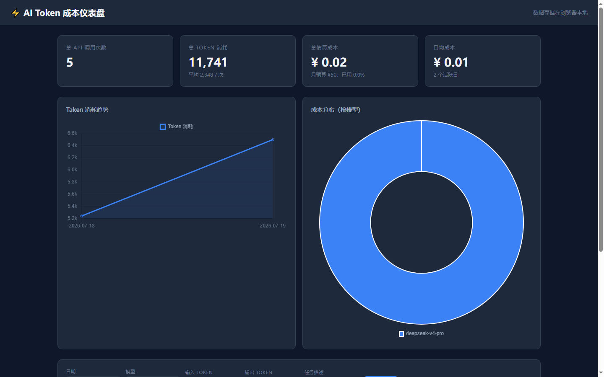

# Claude Code 真实问题解决任务：过程记录

> DEEP 营第一期 · 选修任务二

## 一、问题描述

**原始问题**：我每个月在 AI 编程工具上花了多少钱？每次调用消耗了多少 Token？我需要一个直观、可运行的工具来追踪和可视化这些数据——但我不会写前端图表代码。

**用自然语言向 Claude Code 描述的任务**：帮我做一个 AI Token 成本仪表盘页面，能显示总 Token 消耗和成本统计，用折线图展示每日趋势，用饼图展示不同模型的成本分布，支持手动录入新记录，数据保存在浏览器里，内置我之前真实的实验数据。

**为什么这个问题有意义**：按量计费时代，Token 消耗直接影响成本。做一个仪表盘的目的不是"有个漂亮页面"，而是养成记录和审视 Token 消耗的习惯。月预算 ¥50 是否真的够用——需要数据支撑，而不是靠感觉。

---

## 二、成果展示

### 产出文件

| 文件 | 说明 |
|---|---|
| `index.html` | 仪表盘主页面，包含统计卡片（左侧4个）、Token趋势折线图、成本分布饼图、使用记录表、手动录入表单。使用 Chart.js CDN，数据存储在 localStorage |
| `log.js` | Node.js 命令行日志脚本，用法 `node log.js "任务描述" input output model` |
| `log.json` | 5 条真实使用记录（含实验数据） |
| `README.md` | 项目说明、定价数据来源、使用方式 |
| `screenshots/dashboard.png` | 仪表盘运行截图 |

### 运行截图

### 核心功能验证

- [x] 统计卡片正确显示：5 次调用、约 11,700 tokens、总成本约 ¥0.02
- [x] 趋势图渲染正常
- [x] 成本饼图正确按模型分组
- [x] 使用记录表展示所有条目
- [x] 表单可新增记录，刷新后数据保持
- [x] 重置按钮可恢复示例数据

---

## 三、遇到的问题与解决

### 问题 1：Chart.js CDN 在国内加载缓慢

- 表现：Edge headless 截图可能因 CDN 超时而图表区域空白
- 解决：使用 `--virtual-time-budget=3000` 给足 JS 执行时间；如需离线使用，可将 Chart.js 下载到本地

### 问题 2：git submodule 误创建

- 表现：`cost-dashboard/` 因为包含 `.git/` 目录，被 git 当作 submodule 而非普通目录
- 解决：删除内层 `.git/` 目录，重新 add 并 commit

### 问题 3：截图目录不存在

- 表现：Edge 报错 `Failed to write file ... 系统找不到指定的路径`
- 解决：`mkdir -p screenshots` 先创建目录

---

## 四、能力对应

| 能力 | 本次任务中的体现 |
|---|---|
| 问题描述能力 | 将"想追踪 Token 消耗"这个模糊需求转化为清晰的功能清单：统计卡片 + 趋势图 + 饼图 + 记录表 + 录入表单 |
| AI 工具调用能力 | 全部文件由 Claude Code 生成和修改，包含 HTML/CSS/JS/Node.js，总代码量约 250 行 |
| 结果验收能力 | 打开浏览器验证了：统计数字是否正确、图表是否渲染、表单新增是否生效、数据是否持久化 |
| 报错处理能力 | 遇到 submodule 和截图目录问题后，让 Claude Code 重新定位并修复 |
| GitHub 沉淀能力 | 完整的 git 提交历史，含 commit message 描述变更原因，所有文件可公开访问 |
| 门槛建立能力 | 最终产物是一个可直接使用的可视化工具 + 5 条真实数据，远超"在聊天窗口里问 AI 一个问题"的程度 |

---

## 五、经验总结

1. **自然语言描述需求时，具体的功能场景比技术术语更重要**。与其说"做个 Chart.js 的折线图"，不如说"显示每天花了多少 Token"——AI 自己会用最合适的工具实现。

2. **AI 生成代码的质量取决于验收标准**。如果不明确说"统计卡片里的数字要和表格里的数据一致"，AI 可能生成一个有视觉缺陷但不报错的页面。

3. **最小的增量目标比完美的最终产品更重要**。仪表盘目前只有示例数据和手动录入——但它已经可用，后续可以逐步加（导出 CSV、从 API 自动拉取数据、月度报告生成）。先做能用的，再做完美的。
